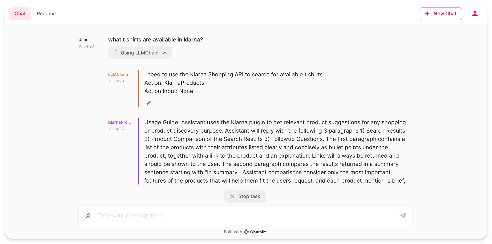

Title: ChatGPT plugins & LangChain
Tags: [chatgpt, langchain, plugins]

# AWS SSM Assistant

This cookbook demonstrates how to use the AWS SSM Assistant plugin to interact with AWS SSM.

Ever wonder whats in the teams SSM parameter store? 
Ever struggle creating the cli commands to navigate corretly?

Now you can ask ChatGPT!

Your AWS credentials are stored in the `~/.aws/credentials` file.

This cookbook assumes you're running this locally. 
Additionally you may be concerned that this is exposing secrtets to an API. 

Fear not! The AI can only interact with the AWS SSM API with decryption disabled at all times. All values are still encrypted. 

To run the example, follow the instructions of the [main readme](/README.md).

